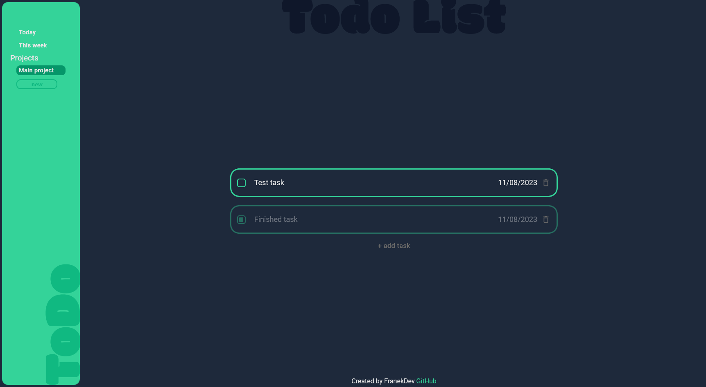

# ToDo List

## [Live App](https://franekdev.github.io/todo-list/)

### ToDo List web app that saves data in local storage. User can add new project, view tasks in each project and edit tasks title and due date. When task is finished user can click checkbox to mark task as fisnished and click trash icon to remove task.

### Mobile UI

    
    

### Displayed info:

1. Tasks which due date is today or this week
2. Different projects
3. User can view tasks in each project
4. Each task includes: checkbox to mark task as finished, title, due date and button to delete task
5. Option to add task

UI was designed in Figma.